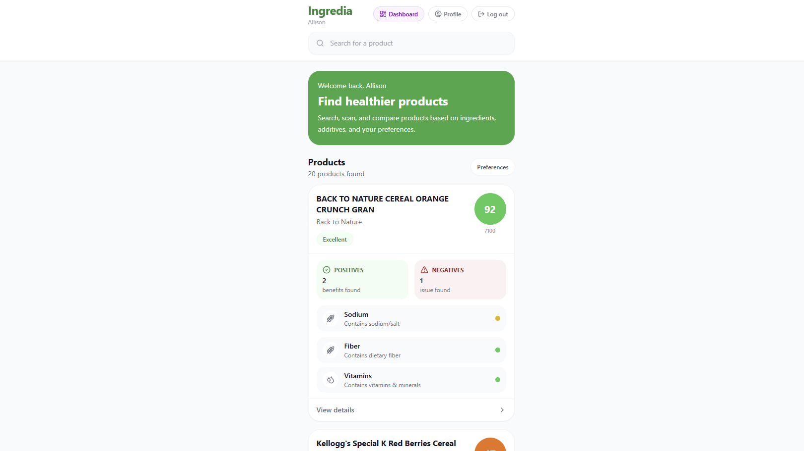

# Ingredia

    <strong>Ingredia</strong> is a web app for evaluating product ingredients.

    Flag allergens, additives, and unwanted ingredients, while browsing product reviews.

    
    <!--  -->

## Project Overview
Ingredia is a social networking for connecting others in regards to checking ingredients within products to indicate if it is healthy, hazardous, unsafe, etc. The web app helps users evaluate product ingredients against personal preferences (allergies and ingredients to avoid) and view product reviews.
- **Goal:** help users evaluate product ingredients against personal dietary preferences and provide lightweight community reviews for safety-awareness
- **Audience:** consumers with allergies or dietary restrictions and medical professionals/reviewers who can provide product assessments

## Features
| **Overview** | **Details** |
|---|---|
| Auth | • Users can register (name, username, email, phone, password) • Password strength validation • Login and logout options |
| Products | • Search products through dataset • Filter by category and dietary restrictions • Flag potential conflicts with preferences • Ingredient analysis (score, positive, negative) • English-specific filtering |
| Reviews and Comments | • View available user reviews per product • Post a review with star rating and comment • All users can edit their own reviews |
| User Profile | • View and update name, username, and phone • Change password option • Role display (explorer, expert, admin) |
| Admin Dashboard | • View all users and reviews • Can delete any user review (within reason) |
| Database | • Store core information into MongoDB • User model - stores user info • Review model - stores reviews per product |

## Project Deployment
### Tech Stack
| **Category** | **Technologies (Tools, Libraries, Frameworks, APIs)** |
|---|---|
| Frontend | React, TypeScript, Tailwind CSS |
| Backend | Express.js (ran on Node.js, files handled in JavaScript) |
| Databases | MongoDB, Mongoose |
| APIs and Data | [Open Food Facts API](https://world.openfoodfacts.org/data), [Kaggle - Food Ingredients List](https://www.kaggle.com/datasets/datafiniti/food-ingredient-lists) |

### Instructions: Steps on How to Run 
| **Step** | **Instructions** |
|---|---|
| Git + GitHub Setup | • Ensure Git is installed ([download](https://git-scm.com/install/windows) based on OS) • Clone [this GitHub repository](https://github.com/UCR-CS110/final-project-ingredia-ahad-allison-lynvy) using an IDE (e.g. Visual Studio Code) &nbsp;&nbsp;&nbsp;&nbsp;• Click "Code" (green button) > HTTPS > copy `https://github.com/UCR-CS110/final-project-ingredia-ahad-allison-lynvy.git` • Run `git clone "https://github.com/UCR-CS110/final-project-ingredia-ahad-allison-lynvy.git"` |
| Installation | • Run `npm install` • Run `npm install lucide-react` • Run `npm install mongodb mongoose bcryptjs dotenv express` |
| Environment Variables | Create a `.env` file in the `backend/` folder.  `PORT=5000` `MONGO_URI=mongodb+srv://<username>:<password>@<cluster_url>/<database_name>?retryWrites=true&w=majority` |
| Backend | • Open up 1st terminal: `cd backend && node seed.js` &nbsp;&nbsp;&nbsp;&nbsp;• Only need to run once • Open up 2nd terminal: `cd backend && node server.js` &nbsp;&nbsp;&nbsp;&nbsp;• Run everytime |
| Frontend | • Open up 3rd terminal: `cd frontend` &nbsp;&nbsp;&nbsp;&nbsp;• Run everytime • Dev: `npm start` &nbsp;&nbsp;&nbsp;&nbsp;• Build: `npm run build` (deploy the `build/` folder to a static host) &nbsp;&nbsp;&nbsp;&nbsp;• Open http://localhost:3000 |

## Team Contributions
### Ahad Hassan
**Fullstack & Authentication**
- Developed the secure user authentication flow (Sign Up and Log In) using Express.js and bcryptjs, ensuring user credentials are safely managed in MongoDB.
- Finalized key React frontend components (such as the LoginPage and global layouts), polishing the UI to ensure a seamless and modern user experience.
- Conducted end-to-end testing of the application flow, verifying that user sessions, preference saving, and product rendering worked smoothly together.
- Authored and structured the project's README documentation, detailing the tech stack, deployment instructions, and feature overviews.

### Allison Pham
**Frontend**
- Search functionality for products
- Preferences filtering with implementation of save (regardless of reloads)
- Pop up cards
    - Update pop up cards for products with details for positive vs. negative breakdown
    - Fix "View details" to ensure a card pops up
- Image fallback logic for missing product images (image icon for products are only displayed for items that had images attached)

**Backend and Databases**
- Migrated from storing locally to MongoDB database
    - Setup MongoDB storage for reviews/comments, user data information to connect each user account with the aspects they interact with (e.g. adding a comment)
    - Test database to ensure updates made through the frontend properly loads in the database
- Connect user accounts to their interactions, reviews/comments, etc.
- Fetch data from datasets (Open Food Facts API and Kaggle Food Ingredients List)
- Ensure data loads dynamically (where it automatically populates)
- Implement different roles for user accounts
    - Roles: explorer (default), expert, admin
        - Admin role is assignable through database
    - Admin dashboard features 2 views: users and reviews
        - Users: see how many users have each role (3 types of roles), searchability (by name, username, or email), lists all users (name, username, email, phone number, join date, role)
        - Reviews: searchability (by email, item name, comment content), list all reviews, ability to delete comments from dashboard
    - All users: ability to edit own and  their own reviews
        - Admin only: can delete other users' comments
- Add profile button with 3 options: profile, password, account
    - Profile: ability to update profile (name, username, phone number)
    - Password: can change password
    - Account: users can see which roles they have
        - Ex: for admin, it will say "Admin - full access"
- Fix preferences functionality
    - Preferences page would pop up every time the page was reloaded
    - Preferences originally didn't save when the page was reloaded
- Scan products with option to request access to camera, handle logic if items weren't in the database, and fix logic
    - Scanning feature ended up being taken out due to the libraries having issues with scannining QR codes (e.g. it needed to match specifically with an item)
        - Attempted with 2 different libraries

**General**
- Debugged frontend, backend, and database features end-to-end
- Test each aspect by noting down any bugs that arose

### Lynvy Chang
- Created the initial frontend design and layout for Ingredia.
- Designed and implemented the main user interface pages, including the product browsing page, product cards, scan modal, preferences modal, and navigation layout.
- Continued improving the visual design to make the app cleaner, more modern, and similar to ingredient-checking apps like Yuka.
- Implemented the login and create account pages.
- Added the authentication flow for users to sign up, log in, and log out.
- Helped build the user profile experience, including displaying a personalized welcome message.
- Worked on user preference features, including allergies and ingredients to avoid.
- Helped connect the frontend pages together and made sure the app flow was clear for the demo.

## AI Usage
We used AI when we first started to help further our ideas and come up with more features. We also used AI to debug certain parts of our code and to learn how to improve the aesthetic of our project.

## Assignment

